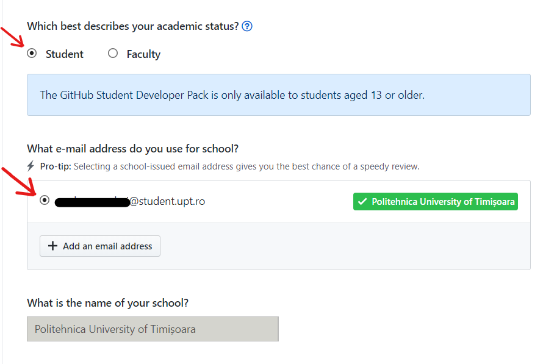

# GitHub Student Pack

Așa cum ți-ai dat seama acest pachet este o posibilitate de a obține programele necesare proiectelor și hobby-urilor tale. Iar totul este gratuit, so yea, why not?

Pentru început trebuie să:

* îți creezi un cont [**GitHub**](https://github.com/join?source=header-home) ****cu mail-ul **de student** primit de la universitatea ta.
* acesezi pagina de la [**GitHub Student Pack**](https://education.github.com/pack) , unde apeși pe butonul **Get the Pack** .
* apoi apeși pe butonul **Get Student Benefits.**
* iar pe pagina deschisă bifează căsuța de la **Student** şi căsuța de langă **adresa ta de mail.**

* în căsuța text de jos scrie pentru ce ai vrea tu să folosești GitHub Student Pack. 

**Exemplu text**: "I want to use GitHub student pack for my university's projects along with my colleagues. It brings me a multiple opportunities and can really help me at studying better."

În scurt timp ar trebui să primești un email de confirmare de la GitHub precum că ai primit pachetul de student GitHub pentru contul tău.

Acum poţi merge să vezi [**lista întreagă de aplicaţii şi licenţe**](https://education.github.com/pack/offers) ****disponibile şi să le încerci pe toate gratuit! Dacă nu eşti foarte sigur cu ce anume să începi, noi îţi propunem să urmăreşti următorul nostru material despre JetBrains şi aplicaţiile lor moderne pentru dezvoltare software😉 


## Întâmpini dificultăți?

Conteactează-mă la adresa ✉ david.lacatusu@ligaac.ro sau mă găsești pe 🌐 [Facebook](https://www.facebook.com/David.Lacatusu16)


